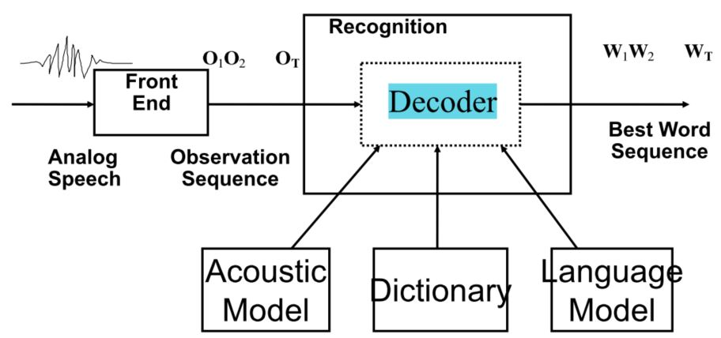
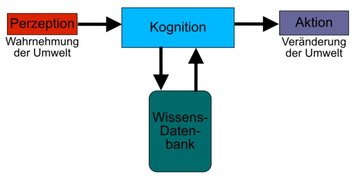

$\DeclareMathOperator{\sinc}{sinc}$
# Kognitive Systeme

## Signalverarbeitung
Teil der Perzeption. Filtern unwichtiger Information um die Datenrate zu reduzieren.

### Fourier
Die Fourierreihe stellt trigonometrische Funktionen dar:

$f(t)=\frac{a_0}{2}+\sum_{n=1}^\infty a_n \cos(\omega n t)+b_n \sin (\omega n t)$ mit $\omega = \frac{2\pi}{T}$

Die entsprechende komplexe Darstellung ergibt sich zu:

$f(t)=\sum_{n=-\infty}^\infty c_n e^{in\omega t}$ mit $c_n= 
	\begin{cases}
		\frac{1}{2}a_0, & \text{for } n=0\\
        \frac{1}{2}(a_n-ib_n), & \text{for } n>0\\
        \frac{1}{2}(a_{-n}+ib_{-n}), & \text{for } n<0
    \end{cases}$

**Transformation und Rücktransformation**:

$F(\omega)=\int_{-\infty}^\infty f(t)e^{-i\omega t}dt$
$f(t)=\frac{1}{2\pi}F(\omega)e^{i\omega t}d\omega$

Dabei bezeichnet $F(\omega)$ das Spektrum, $F|(\omega)|$ das Amplitudenspektrum und $\phi(\omega)$ das Phasenspektrum.  

Neben dem kontinuierlichen (nicht-periodischen) Fall können auch zeitdiskrete Reihen (ggf. nicht-periodisch) mittels Fourier in ein kontrinuierliches Spektrum tranformiert werden ($\Rightarrow$ *Diskrete Zeit Fouriertransformation*). Diskrete, periodische Reihen können in diskrete komplexe Zahlen transformiert werden ($\Rightarrow$ *Diskrete Fouriertransformation* (DFT)). Die DFT kann als Spezialfall der Z-Transformation angesehen werden.

**Fast Fourier Transformation**:
Wird genutzt um diskrete Fourier-Transformationen schneller durchzuführen. Divide-and-Conquer-Schema: Unterteile Reihe mit Länge $2n, n \in \mathbb{N}$ in gerade und ungerade Indizes, bestimme deren DFT und führe die Teilergebnisse zusammen. 
Laufzeit von $O(n\cdot log(n))$.

### Faltung
$(f \star g)(t)=\int_{-\infty}^\infty f(t-\tau)g(\tau)d\tau$ bzw. im zeitdiskreten Raum $(f \star g)[i]=\sum_{j=-\infty}^{\infty}f[i-j]g[j]$.

Rechenregeln:

  * $F(f_1(t)\star f_2(t))=F_1(\omega)\cdot F_2(\omega)$
  * $F(f_1(t)\cdot f_2(t))=F_1(\omega) \star F_2(\omega)$

### Digitalisierung 

**Dirac-Stoß**:
Fläche eines Dirac-Stoßes beträgt 1, der eigentliche Stoß ist jedoch beliebig schmal und hoch. Es gilt die sogenannte *Siebeigenschaft*:

$\int_{-\infty}^\infty \delta (x)\cdot g(x)dx = g(0)$
$\int_{-\infty}^\infty \delta(x-\tau)\cdot g(x)dx = g(\tau)$

#### Sampling 
Kontinuierlich $\Rightarrow$ diskret. Zeitdiskret. Idealerweise dargestellt durch Multiplikation mit einem Impulszug/Dirac-Kamm.

**Nyquist-Shannon Theorem**:
Für ein kontinuierliches, bandbegrenztes Signal mit Grenzfrequenz $F$ muss mit einer Frequenz größer als $2F$ abgetastet werden um das ursprüngliche Signal rekonstruieren zu können. 
Eine Bandbegrenzung ist mittels Tiefpassfilter erreichbar.

**Aliasing**:
Wenn das Nyquist-Shannon Theorem nicht eingehalten wird, kommt es zu Aliasing durch Überlappung der einzelnen Frequenzen. 
	
**Kurzzeitspektralanalyse**:
Spektrum einer ganzen Aufnahme nicht hilfreich, sondern nur Freqnzenzzusammensetzung innerhalb bestimmten Zeitraums.
Dazu kann die DFT für aperiodische Eingaben genutzt werden, in dem nur ein Zeitfenster betrachtet und als periodisch angenommen wird. Problem: Es gibt einen unauflösaren Widerspruch zwischen Zeit- und Frequenzauflösung. 

Da eine Hutfunktion transformiert eine $\sinc$-Funktion ergibt, ist die Fensterung hiermit nicht ideal, da sie das wahre Kurzzeitspektrum des Signals überlagern würde $\Rightarrow$ es sollte eine andere Fensterfunktion verwendet werden.

#### Quantisierung
Analog $\Rightarrow$ digital. Wertdiskret. 
Quantisierungsstufen bestimmen Auflösung. Dynamische Abtastung ermöglichen passgenauere Auflösung in Abhängigkeit der Signalübergänge.  

Durchschnittlicher Quantisierungsfehler: $e_{avg}[i]=\frac{f_{max}-f_{min}}{2n}$

## Klassifikation/Supervised
Supervised Training wird genutzt wenn es vorgegebene Klassen gibt, welche vorab bekannt sind. Unsupervised Training wird bei unbekannten Klassen/Features angewendet.

**Korrelation**:
Zusammenhang zwischen Signalen (Nächster Wert vom vorigen Wert des anderen Signals). Autokorrelation beschreibt Zusammenhang eines Signals mit sich selbst.

**Template Matching**:
Maß der Übereinstimmung zwischen Schablone und Muster soll maximiert werden $\Rightarrow$ Korrelation in Abhängigkeit des Zentrierungspunktes bestimmen.

### Parametrische Modelle
Parametrische Modelle nehmen eine zugrundeliegende Wahrscheinlichkeitsverteilung an. 

**Bayes Decision Theorie**:

$P(\omega_j | x)=\frac{P(x|\omega_j) P(\omega_j)}{P(x)}$ mit $P(x)=\sum_j P(x|\omega_j)P(\omega_j)$.
Dabei ist $P(\omega_j)$ die A-priori-Wahrscheinlichkeit und $P(\omega_j|x)$ die A-posteriori-Wahrschienlichkeit nach Observation von $x$. $P(x|\omega_j)$ nennt sich klassenabhängige Wahrscheinlichkeitsdichte.

Probleme: Limitierte Trainingsdaten und Rechenpower, Labeling potenziell fehlerbehaftet und teuer. Klassen können vorab unbekannt sein, keine guten Features bekannt. 
Bei einer parametrischen Lösung kann man Annehmen dass $P(x|\omega_i)$ eine bestimmte parametrische Form hat, meist wird hierfür eine Normalverteilung gewählt.

**Gaussian Classifier**:

Univariate Normalverteilung: $P(x)=\frac{1}{\sqrt{2\pi \omega}}e^{-\frac{(x-\mu)^2}{2\sigma^2}} \sim N(\mu, \sigma^2)$

Bei multivariaten Normalverteilungen müssen die Parameter für jede Klasse separat geschätzt werden, beispielsweise mittels Maximum Likelihood Estimation.

### Nicht-parametrische Modelle
Generelles Problem bei parametrischen Modellen: Normalverteilung modelliert die Daten eventuell nicht gut. Andere Modelle aber mathematisch schwierig zu lösen. Dann Verwendung nicht-parametrischer Modelle! Auch bei unsupervised Learning anwendbar.

Bei unsupervised Training wird der Error direkt anhand der Daten ermittelt.

**Parzen Windows**:

$P(x) \cdot V =\frac{k}{n}$ mit $k$ als Anzahl Samples im Fenster, $n$ als Anzahl Samples ingesamt und $V$ als Anzahl Samples im Fenster.
Für große $n$ lässt sich so die Wahrscheinlichkeitsdichte ohne zugrundeliegende Verteilungsannahmen berechnen.

**K-Nearest Neighbors**:

Ein Punkt wird der am meisten vorkommenden Klasse unter den $k$ nächsten Samples zugeordnet.

Normalerweise wird $k=\sqrt n$ gesetzt. Grundsätzliches Problem: $k$ sollte groß genug sein, um zuverlässige Werte zu liefern, aber klein genug um ausreichende Nähe der Nachbarn zu garantieren. 

**Curse of Dimensionality und Principal Component Analysis**:
I.A. führen mehr Features zu schlechteren Ergebnissen aufgrund limitierter Datenverfügbarkeit $\Rightarrow$ Features sinnvoll wählen, nur so viele wie nötig.

PCA reduziert Dimensionalität. Grundlegende Annahme ist existierende Korrelation zwischen Dimensionen.

  1. Finde Achse mit größter Datenvarianz
  2. Rotiere den Raum um diese Achse um Korrelation zwischen Dimensionen zu eliminieren
  3. Entferne niedervariante Dimensionen (kaum Informationsverlust)

**Risiko**:
Verlustfunktion: $\sigma(\alpha_i | \omega_j)$ ist der Verlust durch Action $\alpha_i$ im Zustand $\omega_j$.
Der erwartete Verlust bei gegebenem $x$ beträgt dann $R(\alpha_i | x)=\sum_{j=1}^s \lambda (\alpha_i | \omega_j) P(\omega_j | x)$.

**Minimum Error Rate Classification**:
Minimiere Errorrate $\lambda(\alpha_i | \omega_j) = 1 :\Leftrightarrow i\ne j$

**Linear Discriminant Functions**:
Supervised: $g(x)=w_0 + \sum_{i=1}^n w_ix_i$ mit $x_0 = 1$ $\Rightarrow$ Finde Seperator welcher Klassen gut teilt. 

In Abhängigkeit der Relation zu $g_l(x)$ wird dann jedem Punkt eine Klasse zugeordnet. Der Wert kann als Abstand zur Decision Surface interpretiert werden.

**Fisher-Linear Discriminant**:
Set von mehrdimensionalen Punkten wird auf eine Gerade $y$ projiziert. Dann wird die Trenngerade so gewählt, dass der Mittelwert beider Klassen, geteilt durch die Summe der Standardabweichungen der Klassen maximal ist.

### Clustering/Unsupervised

**Mixture Gaussians**:
Bestimme über unsupervised Training Parameter und Gewichtung von mehreren Gauß-Verteilungen die zusammen die Daten abbilden. 

**Hierarchical Clustering/K-Means**:
Beginne mit einem Cluster pro Punkt. Merge zwei Cluster die am nächsten gelegenen sind bis gestoppt wird. Der Prozess kann in einem Dendrogram dargestellt werden, welche die Ähnlichkeit innerhalb eines Clusters zeigt.
Faustformel: Nutze $k=\sqrt n$

Maße für Ähnlichkeit:

  * Minimaler Abstand
  * Durchschnittlicher Abstand
  * Maximaler Abstand

### Neuronale Netze
Nicht-parametrisch.

**Perzeptron**:
Gewichtete Summe der Inputs evaluieren. Entweder wird eine Klasse zugewiesen ($>0$?) oder mittels Hard Limiter/ Threshold Logic/ Sigmoid-Funktion ein Output ausgegeben.

Die Funktion $J_p(\vec{w})=\sum_{\vec{x}\in X}(-\vec{w}\cdot \vec{x})$ gibt für die Klasse der fehlklassifizierten Punkte $X$ den Error an. Dieser sollte minimiert werden (Gradientensuchverfahren). Als Error kann der absolute oder quadrierte Abstand verwendet werden.

**Layers**:
Eingabeschicht, Ausgabeschicht und ggf. versteckte Schichten.

Ausdrucksfähigkeit:

  * Keine versteckte Schicht: lineare Probleme
  * Eine versteckte Schicht: XOR und 2-dimensional leicht clusterbare Probleme
  * Probleme die sich nicht bildlich clustern lassen

Output eines NN repräsentiert a posteriori Wahrscheinlichkeiten. Error wird idR mittels MSE berechnet.

**Spezifikationen**: Netztopologie, Lernfunktion, Zielfunktion, Eingangsgewichte, Lernparameter

**Performance**:
Gründe für schlechte Performance/Generalisierung:

  * Overfitting durch zu viele Iterationen/Lernzyklen $\Rightarrow$ Validation Data nutzen
  * Zu viele Parameter/Gewichte
  * Unpassende Netz-Architektur

## Spracherkennung 

	

**Word Error Rate**:
Methode um die Qualität der Spracherkennung zu messen.

$WER=\frac{\text{#Ins}+\text{#Del}+\text{#Sub}}{\text{#Referenzwörter}}$
Die Referenz wird als Bearbeitungsgrundlage genommen und zur Hypothese umgeformt.

Erkennungsgenauigkeit ACC=1-WER

**Levenshtein-Distanz**:
$M+1$ Spalten für die korrekte Sequenz $M$ und $N+1$ Zeilen bei $N$ Einheiten der Hypothese. 

  * Einfügen: eine Zelle nach rechts, Wert + 1
  * Löschen: eine Zeile nach unten, Wert + 1
  * Ersetzen: eine Zeile nach schräg unten, Wert + 1
  * Übernehmen: eine Zeile nach schräg unten, Wert bleibt gleich.

### Vorverarbeitung
**Alignment**:
Problem: Welche Teile sind einzelne Worte/Aussagen? Menschen sprechen unterschiedlich schnell. Passiert dies innerhalb derselben Äußerung benötigt man nicht-lineares Alignment. 

**Dynamic Time Warping**:
Matrix, wie bei Editing Distance nutzt ein Distanzmaß um Hypothese und Referenz zu vergleichen.

Um die Suche zu vereinfachen, kann man *Beam-Search* verwenden. Dabei werden nur die Zustände mit einer ausreichend geringen kummulierten Distanz weiter expandiert um die Suchzeit zu verringern.

### Akustisches Modell

#### Markow-Ketten
Beschreiben stochastische Prozesse. Für Spracherkennung werden zeitdiskrete Modelle 1. Ordnung (also nur abhängig vom direkt vorhergehenden Zustand) mit endlichem Zustandsraum verwendet.
Zudem sollten die Ketten homogen sein, d.h. Übergangswahrscheinlichkeiten zwischen Zuständen sind unabhängig von der Zeit.

Topologie:

  * Ergodisch: voll vermascht
  * Left-to-right: Übergänge nur zu Zuständen mit höherem Index und zu sich selbst. Dadurch wird eine zeitliche Ordnung enforct.

**Nicht-beobachtbare Zustände/HMMs**:

Probleme:

  * Evaluierung: Gegeben HMM und Ausgabe, finde Wahrscheinlichkeit mit der die Ausgabe von diesem HMM stammt. Forward oder Viterbi.
  * Dekodierung: Gegeben HMM, finde Zustandsfolge mit höchster Wahrscheinlichkeit. Viterbi (sucht nur max. Wahrscheinlichkeit).
  * Training: Finde gegeben einem HMM bessere Parameter. Forward-Backward.

Es ist kein Verfahren bekannt, um Topologie simultan zuden restlichen Parametern zu optimieren. 

**Viterbi**:

  * Auftretenswahrscheinlichkeit: Matrix-Schreibweise mit den Zuständen als Zeilen und den Zeitpunkten als Spalten. In das Kästchen die Summe der Wahrscheinlichkeiten der eingehenden Pfeile schreiben.
  * Wahrscheinlichste Zustandskette: Selbe Matrix ausfüllen, allerdings die Wahrschieilichkeiten verschiedener Wege nicht addieren, sondern nur den Weg mit der höchsten Wahrscheinlichkeit behalten.

**Kontext**:
Da Markow-Ketten keinen Kontext miteinbeziehen, ist es sinnvoll hybride aus HMMs und NN zu schaffen. 

#### Wörterbücher
Phonetische oder Wörterbücher, ggf. Tree-structured.

#### Sprachmodell
**Fundamentalformel**:
Statistische Methode zur Erkennung von gesprochener Sprache, von Naive Bayes abgeleitet.

$\hat{W}=\arg \max_{w\in \mathcal{W}} P(W | X) = \arg \max_{w\in \mathcal{W}} \frac{P(X|W)\cdot P(W)}{P(X)}$ 

Hierbei ist $\hat{W}$ die Hypothese, $X$ der Merkmalsvektor, $P(X|W)$ das akustische Modell und $P(W)$ das Sprachmodell. $\mathcal{W}$ ist das Wörterbuch. 

*Rechenhinweis*: Der Nenner kann weggelassen werden, wenn es nur um einen Vergleich von zwei Modellen geht. 

**Perplexität**:
Maß für die Güte eines Sprachmodells.

## Grundlagen Bildverarbeitung

Elemente eines Kognitiven Systems:

	

Kognition beinhaltet Algorithmen zur Deduktion, Induktion und zum Lernen.

### Kameramodell

**Lochkamera**:
Übertragung eines Punktes $P=(X,Y,Z)$ auf Bildpunkt $p=(u,v,w)$:

  1. $w$ ist der (negative) Abstand vom Projektionszentrum zur Projektionsfläche.
  2. Herleitung der restlichen Koordinaten mittels Strahlensatz:
     $-\frac{u}{f}=\frac{X}{Z}$ und $-\frac{v}{f}=\frac{Y}{Z}$.
     Vereinfacht: $p=-\frac{f}{Z}P$ (bei Negativlage).

Für die Bildebene können CCD-Chips verwendet werden (lichtempfindliche Elektronische Bausteine). Eine Zelle des Chips ist ein Pixel.

Alle Punkte die auf der Geraden zwischen dem Projektionszentrum und dem Bildpunkt liegen werden auf dieselbe Stelle projiziert.

In der Regel wird die Positivlage für Berechnungen verwendet, da hierbei keine Spiegelung entsteht. 

**Homogene Koordinaten**:
Dienen der Vereinheitlichung der Darstellung von Translationen mit der von Rotationen, usw. durch zusätzliche Dimension. 

Dritte Dimension als 1: Symbolisiert einen Punkt.

**Kalibriermatrix**:
Dient zur Abbildung vom Kamera- in das Bildkoordinatensystem mittels der intrinsisches Kameraparameter. Kalibrierung selbst kann zum Beispiel mittel Direkter Linearer Transformation durchgeführt werden.

$\begin{pmatrix}
f_x & 0 & c_x\\
0 & f_y & c_y\\
0 & 0 & 1\\
\end{pmatrix}$

wobei $f_x, f_y$ die Brennweite in Pixeln umgerechnet sind.

$A_B=K\cdot A_C$

**Projektionsmatrix**:
$P=\begin{pmatrix}K & R &| &K & \vec{t}\end{pmatrix}$
Bildet einen 3D-Punkt $X$ von einem Objekt auf einen 2D-Bildpunkt $x$ auf der Kamera ab $x=PX$  

**Essentialmatrix**:
Definiert durch extrinsischen Kameraparameter $R_i$ und $t_i$.

$E=\begin{pmatrix}
	0 & -t_3 & t_2\\
	t_3 & 0 & -t_1\\
	-t_2 & t_1 & 0
\end{pmatrix}R$

hierbei ist das Weltkoordinatensystem gleich dem Kamerakoordinatensystem der Kamera 1 und E wird für die Parameter von Kamera 2 berechnet. 

$x_c=\vec{R}\cdot x_w + \vec{t}$

**Fundamentalmatrix**:
Dient zur Berechnung der Epipolarlinien durch Rektifizierung. Zum Berechnen der Fundamentalmatrix wird die Essential- und Kalibriermatrix benötigt!

$F=K'^{-T}EK^{-1}$.

Rektifizierung: Veränderung der Eingabebilder sodass alle Epipolarlinien horizontal yur äquivalenten $v$-Korrdinate im anderen Kamerabild liegen $\Rightarrow$ leichtere Durchsuchung von Korrespondenzen.
Theoretisch entspräche dies zwei parallelen Kameras mit identischer Ausrichtung.

**Epipole**:
Alle Epipolarlinien im nicht-rektifizierten Bild gehen durch den Epipol. Der Epipol ist der Schnittpunkt des Verbindungvektors der Projektionszentren mit der Bildebene.

$e=-KR^Tt$ bzw $e'=K't$

$l=F^T x'$ bzw. $l'=Fx$

wobei jeweils das Weltkoordinatensystem auf die normale Kamera gerichtet ist. 

### Bildrepräsentation

Farbmodelle:
  
  * S/W: Nur Graustufen.
  * RGB: Additive Farbmischung von Rot/Grün/Blau, alle Farben zusammen ergeben Weiß (siehe Überlagerung von Lichtwellen).
  * CYMK: Subtraktive Farbmischung (es werden sozusagen Lichtwellenspektren absorbiert/subtrahiert), wenn alle übereinander liegen, verbleibt schwarz, da alle Wellen absorbiert werden.
  * HSI: Hue besitmmt Farbnuance, Saturation die Sättigung und Intensity die Helligkeit. 
	Durch Trennung von Helligkeit und Farbwert ist HSI unempfindlich gegen Beleuchtungsänderungen $\Rightarrow$ Gut für Farbsegmentierung.
	Wenn $R=G=B$ dann ist $H$ undefiniert, falls $R=G=B=0$ dann ist zudem $S$ undefiniert
  * HSV: Hue, Saturation, Value. Wird speziell zur Farbsegmentierung benutzt. 

**Speicherung**: 
Graustufen: 1 Byte pro Pixel, Kodierung zwischen 0 und 255. 
Farbbilder: Drei Bytes pro Pixel für RGB, ebenfalls zwischen 0 und 255.

**Bayer-Pattern**:
Nur sehr hochwertige Kameras besitzen drei Chips pro Pixel um RGB richtig aufzunehmen. Normalerweise wird jedoch das Bayer-Pattern verwendet, bei dem ein Chip pro Pixel je eine Farbe detektiert. Da das menschliche Auge gegenüber grün am empfindlichsten ist, wird in jeder Zeile Grün, abwechselnd mit Rot und Blau detektiert.

### Bildverarbeitung

**Homogene Punktoperatoren**:
Abänderung eines Pixels unabhängig von Position innerhalb der Matrix.

**Affine Punktoperatoren**: Wenn die Funktion in der Form $ax+b$ mit von den Daten unabhängigem $a, b$ darstellbar ist, so ist sie affin. Grenzen einhalten beeinträchtigt Affinität nicht.

Anwendungsgebiete: 

  * Affine Operatoren: Kontrast- und Helligkeiterhöhung/-senkung (keine dynamische Anpassung!), Invertierung
  * Nicht-affine Operatoren: Auslgleich von Sensor-Nichtlinearitäten, Gewichtung, Binarisierung

#### Histogramm-Modifikationen
 
  * Spreizung: $I'(u,v)= 255 \cdot \frac{I(u,v)-min}{max-min}$
  * Histogrammdehnung: $I'(u,v)=255\cdot \frac{I(u,v)-H_q(min)}{H_q(max)-H_q(min)}$
  * Histogrammausgleich: $H_n(x)=255\cdot \frac{H_a(x)}{\text{#Werte}}$

#### Lokale Operatoren
Berücksichtigung der Nachbarschaft von Pixeln. Anwendung bei Filterung, Masken, ...

Bei Masken können die Werte am Rand nicht berechnet werden, da nicht alle Umgebungspixel definiert sind. Bei mehreren Iterationen setzt sich dies immer weiter fort! 
Möglicher Lösungsansatz ist periodische Fortsetzung des Bildes, ist aber nicht immer eine valide Annahme.

**Glättungfilter/Tiefpassfilter**:

  * Rechteck-/Mittelwertfilter: Flacht extreme Punkte ab (verschmiert) und glättet proportional zur Maskengröße. Schnelle Berechnung möglich. $\frac{1}{9}\begin{pmatrix}1&1&1\\1&1&1\\1&1&1\end{pmatrix}$
  * Gauß-/Binomialfilter: Glättet stärker als Rechteckfilter, Einfluss der Umgebung in Abhängigkeit des Abstands, dadurch werden Kanten nicht so stark abgeflacht.
  $\frac{1}{16}\begin{pmatrix}1&2&1\\2&4&2\\1&2&1\end{pmatrix}$
  * Medianfilter: Pixel wird Median der Werte der Nachbarschaft zugeordnet. Geringer Glättungseffekt, dafür leiden Schärfe und Kanten kaum. Außreißer werden kaum berücksichtigt. Kann mittels Histogramm berechnet werden.

Anisotrope Filter: Weisen nicht in alle Richtungen dieselben Eigenschaften auf.

  * Bilateralfilter: Kantenerhaltender Glättungsfilter, aber dafür schwer berechenbar da nicht-linear.
  * Mean-Shift-Filter: Mittlerem Pixel wird der wahrschienlichste Wert aus der Nachbarschaft zugeordnet. Dann wird Suchfenster auf die höchste Wahrscheinlichkeit gesetzt und von vorne begonnen. 

**Kantendetektion/Hochpassfilter**:

  * Prewitt-X-Filter: Betont vertikale Kanten. $\begin{pmatrix}-1&0&1\\-1&0&1\\-1&0&1\end{pmatrix}$. Prewitt-Y-Filter ist um 90° gedreht. Der Prewitt-Operator $M=\sqrt{P_x^2+P_y^2}$ dient zur Bestimmung des Gradientenbetrags $M$.
  * Sobel-X-Filter: Prewitt multipliziert mit Gauß zur Betonung der Kanten. $\begin{pmatrix}1&0&-1\\2&0&-2\\1&0&-1\end{pmatrix}$. Sobel-Y-Filter ist um 90° gedreht. Sobel-Operator $M=\sqrt{S_x^2+S_y^2}$ zur Bestimmung des Gradientenbetrags $M$.
  * Laplace-Filter: Idee dahinter ist dass Kanten Nullstellen in der 2. Ableitung sind. $\begin{pmatrix}0&1&0\\1&-4&1\\0&1&0\end{pmatrix}$. Dadurch richtungsunabhängige Kantenverstärkung, allerdings empfindlich gegenüber Rauschen. Gegenmaßnahme: Vorab durch Gaußfilter glätten (*Laplace of Gaussian*).
  * Canny: Ziel einer guten Kantendetektion, -lokalisierung und einer minimalen Antwort, also dünnen Linien. Daher binäre Antwort. 
    1. Gauß-Filter
    2. Gradientenberechnung mittels Prewitt- oder Sobel-Operator
    3. Non-Maximum-Suppression, sodass nur maximale Gradienten verbleiben
    4. Hysterese-Schwellwertverfahren, sodass nur ausreichend hohe Gradienten verbleiben.
  * Roberts-X: Diagonale Kantendetektion. $\begin{pmatrix}-1&0\\0&1\end{pmatrix}$

**Bildanalyse**:
Frequenzen geben Aufschluss über Grauwertübergänge, daher sind Fourier-Transformationen hilfreich.

Ergebnis der Fouriertransformation sind Spektrum und Phase. Beide zusammen erlauben eine Rekonstruktion des Originalbilds.

### Segmentierung
#### Schwellwert
**Multilevel-Otsu-Verfahren**:
Automatisches multimodales Schwellwertverfahren. Findet beste Schwellwerte anhand der gegebenen Bildpunkte, genauer gesagt der Inter- und Intraklassenvarianz (Diskriminanzkriterium).

#### Farbe
Wechselnde Lichtbedingungen wie Reflexionen und Schattenwürfe können Schwierigkeiten bereiten. 

**HS-Histogramm**:
Eliminiert Helligkeit als Faktor vom HSI-Modell um invariant gegenüber Lichtbedingungen zu sein.

#### Morphologische Operatoren
Dilatation und Erosion als Grundoperationen.

**Opening**:
Erosion + Dilatation

**Closing**: 
Dilatation + Erosion

**Vermeidung**:
n-fache Kombination von Erosion und Dilatation.

#### Bewegung
Differenzbilder mittels Subtraktion aufeinanderfolgender Bilder mit anschließender Schwellwertfilterung. Regionen in denen keine Bewgung stattfindet sind schwarz (da zu 0 subtrahiert).

#### Region Growing
Suche nach zusammenhängenden Regionen mittels Schwellwerten

#### Hough-Transformation
Zur Erkennung gerader Linien im Bild. Linie wird in Polarkoordinaten dargestellt: $r=x \cos \theta + y \sin \theta$.

Punkte im Bildraum entsprechen Sinusoid im Parameterraum (der Transformierten) und umgekehrt.

Für Kreisdetektion: $r^2=x^2+y^2$. Gesuchter Kreis entspricht Schnittpunkt von Kreisen der Transformierten.

#### Texturierte Objekte
Grundsätzlich schwer zu erkennen.

Harris Corner Detector: Sind Eigenwerte der Gradientenmatrix groß, dann bedeutet eine kleine Bewegung eine große Veränderung. Suche Ecken durch lokale Maxima.
 
#### Wiedererkennung von Punkten/Korrespondenzproblem
Grundsätzlich durch Feature Detektoren (beschreiben Suchfunktion) oder Deskriptoren (beschreiben Pixel-Patch) möglich.

**Sum of Squared Differences**:
Summe der quadrierten pixelweisen Differenz zum Mittelwert. Gut für kleine Werte.

**Zero Mean Normalized Cross Correlation**:
Summe der quadrierten pixelweisen Differenz, punktweise multipliziert miteinander. Gut für große Werte.

#### Human Motion Capture
Problem ist die Bestimmung der Konfiguration eines Menschen (Gelenkwinkel) anhand von Bildern.
Das HMC besteht aus kinematischem (Definiert Körper) und geometrischem Modell.
Aktionen werden dann mittels HMM/Dynamic Movement Primitives/Spline-based Representations dargestellt.

## 3D-Bildverarbeitung
### Geometrische 3D-Transformationen 	

Darstellungsarten für 3D-Bildverarbeitungen: 
  
**Homogene Transformationsmatrizen und Vektoren**:
Für Translationen und Rotationen

Translation eines Vektors:
$\begin{pmatrix}
	x_0\\
	y_0\\
	z_0
\end{pmatrix} + \begin{pmatrix}
	x\\
	y\\
	z
\end{pmatrix} = \begin{pmatrix}
	x_0+x\\
	y_0+y\\
	z_0+z
\end{pmatrix}$

Rotation: 
$\begin{pmatrix}
	x\\
	y\\
	z
\end{pmatrix} = R\begin{pmatrix}
	x_0\\
	y_0\\
	z_0
\end{pmatrix}$
wobei $R$ die jeweilige Rotationsmatrix ist:
  * $R_x(\theta)=\begin{pmatrix}
  		1 & 0 & 0\\
  		0 & \cos \theta & -\sin \theta\\
  		0 & \sin \theta & \cos \theta
  	\end{pmatrix}$
  * $R_y(\theta)=\begin{pmatrix}
  		\cos \theta & 0 & \sin \theta\\
  		0 & 1 & 0\\
  		-\sin \theta & 0 & \cos \theta
  	\end{pmatrix}$
  * $R_z(\theta)=\begin{pmatrix}
  		\cos \theta & -\sin \theta & 0\\
  		\sin \theta & \cos \theta & 0\\
  		0 & 0 & 1
  	\end{pmatrix}$

Rotationsmatrizen sind regulär, invertierbar und besitzen eine Determinante von 1. Die Achsen können mitgedreht ($R_{X'Y'Z'}(\alpha, \beta, \gamma)$) werden oder raumfest ($R_{ZYX}(\gamma,\beta,\alpha)\$) sein.
Zudem sind die orthogonal, daher ist die Inverse einer Rotationsmatrix ihre Transponierte.

Problem: Hohe Redunanz bei Rotationsmatrizen, sehr rechenaufwändig und schwierig zu interpolieren. Be Euler-Winkeln besteht das Problem der Singularität, d.h. eine einzige Drehung kann durch mehrere Euler-Winkel dargestellt werden und ist somit nicht mehr invertierbar.
 
**Quaternionen**:
Nur für Rotationen geeignet. Erweitert komplexe Zahlen in vierdimensionalen Raum. 
Ein Quaternion hat die Form $q=(q_w,q_x,q_y,q_z)=(q_w,q_v)$ wobei $q_w$ der Realteil und $q_v$ der Imaginärteil ist.

Rechenregeln:
  
  * Multiplikation ist *nicht* kommutativ! 
  * Konjunktion eines Quaternions entspricht dem Versehen des Imaginärteils mit zusätzlichem Minuszeichen
  * Inverse enstpricht dem invertieren und teilen durch die quadrierte Norm

Problem der Quaternionen: Nur Rotationen 

Es ist möglich Quaternionen in Rotationsmatrizen umzuwandeln und umgekehrt. 

## Logik 

$\text{Logik}:=(\text{Symbolmenge} S, \text{Belegungsmenge} M, \text{Syntax}, \text{Semantik},\text{Folgerungsoperator})$

Aus Sätzen in einer Wissenrepräsentationsspache wird Wissen abgeleitet (Deduktion). 
Wenn der Satz $\alpha$ durch Algorithmus $i$ aus der Wissensbasis abgeleitet werden kann, so schreibt man $WB\vdash_i \alpha$. 

**Korrektheit**:
Leitet nur Sätze ab, die aus der WB folgen.
$WB\vdash_i \alpha \Rightarrow WB\Vdash_i \alpha$ 

**Vollständigkeit**:
Leitet alle Sätze aus der WB ab, die aus WB folgen.
$WB\Vdash_i \alpha \Rightarrow WB\vdash_i \alpha$

### Aussagenlogik

**Modus Ponens**:
Aus der Implikation und $\alpha$ kann $\beta$ gefolgert werden: $\frac{\alpha\Rightarrow \beta , \alpha}{\beta} 

**Resolutionsalgorithmus**:
Wissensbasis auf KNF bringen, durch Resolutionsregel können neue Klauseln zur WB hinzugefügt werden. Sollte eine leere Klausel erzeugt werden, so ist die Klauselmenge unerfüllbar.
Problem: NP-vollständig.

Um zu überprüfen, ob eine wahre Belegung für ein Literal existiert, kann das negierte Literal zur Menge hinzugefügt werden. Wenn die leere Menge abgeleitet werden kann, ist ein eine Belegung durch Widerspruchsbeweis gezeigt.

**Davis-Putnam-Logemann-Loveland (DPLL)-Algorithmus**:
Verbesserung des Resolutionsalgorithmus durch Einschränkungen des Suchraums mittels Einheitklauseln und reinen Symbolen sowie früheren Abbruch.

Nacheinander Literale belegen: 

  1. Finde Einheitsklauseln (Literal, welches alleine eine Klausel ist)
  2. Finde reine Literale (Literal, welches in allen Klauseln nur negiert bzw. nicht-negiert vorkommt)
  3. Setze erstes verbleibendes Symbol TRUE oder FALSE

#### Horn-Klauseln
Disjunktion von Literalen von denen höchstens Eines positiv ist!

  * Kein negatives Literal: Fakt/Axiom
  * Genau ein positives Literal: Definition
  * Kein positives Literal: Integritätseinschränkung

Visualisierbar als Und-Oder-Graph. Folgerungsentscheidung kann in linearer Zeit geschehen. Nutze dazu Vorwärts- (Durchführbare Folgerungsentscheidungen) oder Rückwärtsverkettung (Wahrheitsgehalt Anfrage).

### Prädikatenlogik
Aussagenlogik nicht sehr mächtig, Prädikatenlogik aussagekräftiger, aber auch schwieriger zu behandeln. 
Erfüllbarkeit ist nur semientscheidbar, da Algorithmen bei Entscheidbarkeit nicht immer terminieren. 

#### Planungssprachen

**Stanford Research Institute Problem Solver (STRIPS)**:
Zustandsrepräsentation:

  * Konjunktion von positiven Literalen
  * Funktions- und Variablenfreie Literale erster Ordnung.
  * Jeder Zustand ist vollständig bekannt, "geschlossene Welt"-Annahme: im Zustand unbestimmte Literale gelten als falsch.

Zielrepräsentation: Teilweise spezifizierter Zustand

Aktionen: $A=(N_A,P_A,V_A,E_A$ Aktionsname $N$, Parameter $P$ (in Bezug auf Aktion), Vorbedingungen $V$, Effekte $E$. Eine Aktion heißt *anwendbar* auf eine Belegung, wenn sie alle Vorbedingungen erfüllt.

Einschränkungen: Literale müssen funktionsfrei und positiv sein, geschlossene Welt Annahme. Aussagen oft lang und unübersichtlich.

**Action Description Language (ADL)**:
Keine geschlossene Welt-Annahme, nicht angegebene Literale gelten als unbekannt, negative Literale und Disjunktionen erlaubt. 

##### Planungsstragien
Suche im Zustandsraum einfach, um naive Suche zuverbessern entweder Segmentierung oder Heuristik verwenden.

  * Greedy mit Heuristik, keine Garantie
  * A\*, garantiert kürzesten Weg, Effizienz abhängig von Heuristik.

#### Zeitsensitive Planung/Scheduling

**Partial Order Planning**: 
Plan legt keine totale, sondern nur partielle Ordnung auf allen Aktionen mittels der Vorbedingungen fest, dabei dürfen keine Zyklen entstehen. 

**Planungsgraphen**: 
Verbindet Zeitabschnitte. Sich gegenseitig ausschließende Aktionen und Literale durch Mutex-Link verbinden.

#### Umweltmodelle
Verschiedene Abstraktionsstufen: Geometrische, topologische (+ Abstand) und semantische Darstellung (+ Art/Struktur von Objekten)

**Objektmodellierung**:
  
  * Kantenmodelle: Ermittlung markanter Punkte welche durch Kanten verbunden werden.
  * Oberflächenodelle: Darstellung ebener Flächen mittels Polygone und gekrümmter Objekte mit Zyklinder/Kegel/...
  * Volumenmodelle
    * Begrenzungsflächen: Beschreibung des Körpers durch umgebende geometrische Kanten in festgelegtem Richtungssinn
    * Constructive Solid Geometry: Zusammensetzung von Körpern aus parametrierbaren Grundelementen auf welche Positionierungen und boolesche Operatoren angwendet werden. Problem: hoher Rechenaufwand

#### Bahnplanung
Erfolgt im Freiraum. Konfigurationsraum ist der Raum dessen Dimensionen die für die Planung relevanten Parameter beinhaltet.

Gegeben: Umgebungskarte, welche Trennung in Frei- und Hindernisraum festhält.

**Polygonzerlegung**:
Raum von Hinternisecken ausgehend in Polygone zerlegen. Trennlinien werden von oben nach unten bis zur nächsten Hinderniskante gezogen. Polygone müssen komplett frei oder komplett unpassierbar sein. Wegenetz geht durch Mittelpunkte der Freiraumpolygone sowie die Mittelpunkte der Trennlinien benachbarter Polygone.
Benutze dann z.B. A\*.

Problem: ggf. große Umwege bei großen Freiräumen/Polygonen.

**Sichtgraphen**:
Ziel: Suche nach kürzestem Weg! Ziehe Weglinien als Sichtverbindungen zwischen Hindernisecken (inklusive Rand der Hindernisse). Ecken sind Suchknoten Wegenetz.

Problem: Gräße des Roboters sollte auf Hinternisse augmentiert werden, damit es zu keiner Kollision kommt. Methode ist exakt wenn es nur zwei translatorische Freiheitsgrade gibt und der Roboter und die Hindernisse jeweils als Polygone darstellbar sind.

**Quadtrees**:
Aufteilung eines Raums in Quadrate dynamischer Größe. Quadrate müssen entweder kompplett frei oder komplett blockiert sein, gemischte Quadrate werden weiter aufgespalten. Dadurch ist die Auflösung in jedem Bereich nur so genau wie nötig, es wird kein Speicher verschwendet.

**Voronoi-Diagramme**:
Äquidistanzlinien zwischen den Hindernissen und dem Raum, dadurch wird maximale Freiheit von Hindernissen garantiert, jedoch kann dies auch ein großer Umweg sein.

**Potentialfeldmethode**:
Definiere Konfigurationsfeld als Potentialraum, wobei das globale Minimum im Zielpunkt liegt. Hindernisse haben sehr hohes Potenzial. Nutze Gradientenabstiegs-Methode.

Problem: lokale Minima.

## Robotik

Grundprobleme: Dynamik $\Rightarrow$ Kinematik $\Rightarrow$ Geometrie(Hindernis-, Freiraum, Kollisionsvermeidung, ...)

**Kinematik**:
Modell beschreibt Zusammenhänge zwischen Raum der Gelenkwinkel und Raum der Lage des Endeffektors in Weltkoordinaten.

**Dynamik**: 
Modell beschreibt Zusammenhand zwischen Kräften, Momenten und Bewegungen, welche in einem mechanischem Mehrkörpersystem auftreten.

Komponenten eines Roboters: 

  * Mechanisch: Gelenke, Arbeitsraum (kartesisch, kugel- oder zyklinderförmig), Radkonfigurationen (Differential-, Dreirad-, Synchro- oder Mecanum-Antrieb)
  * Antriebe: Fluid, muskelartig oder elektrisch
  * Sensoren: Benötigt zur Regelung bei unbekannten Störgrößen. Elementare, integrierte oder intelligente Sensoren. Zudem Klassifikation als interne/externe und aktive/passive Sensoren.
  * Getriebe

**DH-Parameter**:
Beschreibt Transformation von Objektkoordinatensystemen ineinander: Rotation, Translation, Translation, Rotation.

**Merkmalsextraktions-Module**:
Lösung der Abstrahierung beim Lernen, sodass neues Wissen möglichst auf neue Domänen angewendet werden kann.